## react-native-svg

[](https://www.npmjs.com/package/react-native-svg)
[](https://travis-ci.org/magicismight/react-native-svg)
[](https://www.npmjs.com/package/react-native-svg)

`react-native-svg` is built to provide a SVG interface to react native on both iOS and Android

# IMPORTANT：

`react-native-svg` **NO LONGER rely on ReactNativeART**, it has its own native code dependency now (which is based on ReactNativeART code but support more SVG features)


### Features

1. Supports most of SVG elements and properties(Rect, Circle, Line, Polyline, Polygon, G ...).
2. Easy to convert SVG code into ReactNative code.


#### Install

### note:
react-native-svg >= 3.2.0 only supports react-native >= 0.29.0
react-native-svg >= 4.2.0 only supports react-native >= 0.32.0
react-native-svg >= 4.3.0 only supports react-native >= 0.33.0

1. Install library from npm.

```bash
npm install react-native-svg --save
```

2 . Link native code

```bash
react-native link react-native-svg
```
react-native@0.29.0 and 0.29.1 cannot work with Android link properly:[here](https://github.com/facebook/react-native/pull/8612)


Or use rnpm instead

```bash
rnpm link react-native-svg
```


#### Usage

There is an easy example

```javascript
import Svg,{
    Circle,
    Ellipse,
    G,
    LinearGradient,
    RadialGradient,
    Line,
    Path,
    Polygon,
    Polyline,
    Rect,
    Symbol,
    Text,
    Use,
    Defs,
    Stop
} from 'react-native-svg';

class SvgExample extends Component {
    render() {
        return (
            <Svg
                height="100"
                width="100"
            >
                <Circle
                    cx="50"
                    cy="50"
                    r="45"
                    stroke="blue"
                    strokeWidth="2.5"
                    fill="green"
                />
                <Rect
                    x="15"
                    y="15"
                    width="70"
                    height="70"
                    stroke="red"
                    strokeWidth="2"
                    fill="yellow"
                />
            </Svg>
        );
    }
}

```

This will draw a graphics like this
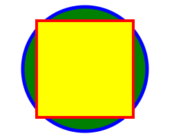

#### Common props:

Name            | Default    | Description
----------------|------------|--------------
fill            | '#000'     | The fill prop refers to the color inside the shape.
fillOpacity     | 1          | This prop specifies the opacity of the color or the content the current object is filled with.
stroke          | 'none'     | The stroke prop controls how the outline of a shape appears.
strokeWidth     | 1          | The strokeWidth prop specifies the width of the outline on the current object.
strokeOpacity   | 1          | The strokeOpacity prop specifies the opacity of the outline on the current object.
strokeLinecap   | 'square'   | The strokeLinecap prop specifies the shape to be used at the end of open subpaths when they are stroked.
strokeLinejoin  | 'miter'    | The strokeLinejoin prop specifies the shape to be used at the corners of paths or basic shapes when they are stroked.
strokeDasharray | []         | The strokeDasharray prop controls the pattern of dashes and gaps used to stroke paths.
strokeDashoffset| null       | The strokeDashoffset prop specifies the distance into the dash pattern to start the dash.
x               | 0          | Translate distance on x-axis.
y               | 0          | Translate distance on y-axis.
rotate          | 0          | Rotation degree value on the current object.
scale           | 1          | Scale value on the current object.
origin          | 0, 0       | Transform origin coordinates for the current object.
originX         | 0          | Transform originX coordinates for the current object.
originY         | 0          | Transform originY coordinates for the current object.


#### Supported elements:

##### Svg

```html
<Svg
    height="100"
    width="100"
>
    <Rect x="0" y="0" width="100" height="100" fill="black" />
    <Circle cx="50" cy="50" r="30" fill="yellow" />
    <Circle cx="40" cy="40" r="4" fill="black" />
    <Circle cx="60" cy="40" r="4" fill="black" />
    <Path d="M 40 60 A 10 10 0 0 0 60 60" stroke="black" />
</Svg>
```

##### Rect

The <Rect> element is used to create a rectangle and variations of a rectangle shape:

```html
<Svg
    width="200"
    height="60"
>
    <Rect
        x="25"
        y="5"
        width="150"
        height="50"
        fill="rgb(0,0,255)"
        strokeWidth="3"
        stroke="rgb(0,0,0)"
    />
</Svg>
```

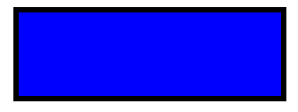

  Code explanation:

  * The width and height props of the <Rect> element define the height and the width of the rectangle
  * The x prop defines the left position of the rectangle (e.g. x="25" places the rectangle 25 px from the left margin)
  * The y prop defines the top position of the rectangle (e.g. y="5" places the rectangle 5 px from the top margin)

##### Circle

The <Circle> element is used to create a circle:

```html
<Svg
    height="100"
    width="100"
>
    <Circle
        cx="50"
        cy="50"
        r="50"
        fill="pink"
    />
</Svg>
```

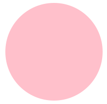

  Code explanation:

  * The cx and cy props define the x and y coordinates of the center of the circle. If cx and cy are omitted, the circle's center is set to (0,0)
  * The r prop defines the radius of the circle

##### Ellipse

The <Ellipse> element is used to create an ellipse.

An ellipse is closely related to a circle. The difference is that an ellipse has an x and a y radius that differs from each other, while a circle has equal x and y radius

```html
<Svg
    height="100"
    width="110"
>
    <Ellipse
        cx="55"
        cy="55"
        rx="50"
        ry="30"
        stroke="purple"
        strokeWidth="2"
        fill="yellow"
    />
</Svg>
```
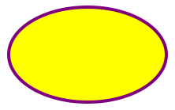

  Code explanation:

  * The cx prop defines the x coordinate of the center of the ellipse
  * The cy prop defines the y coordinate of the center of the ellipse
  * The rx prop defines the horizontal radius
  * The ry prop defines the vertical radius

##### Line

The <Line> element is an SVG basic shape, used to create a line connecting two points.

```html
<Svg
    height="100"
    width="100"
>
    <Line
        x1="0"
        y1="0"
        x2="100"
        y2="100"
        stroke="red"
        strokeWidth="2"
    />
</Svg>
```

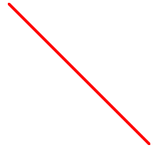

  Code explanation:

  * The x1 prop defines the start of the line on the x-axis
  * The y1 prop defines the start of the line on the y-axis
  * The x2 prop defines the end of the line on the x-axis
  * The y2 prop defines the end of the line on the y-axis

##### Polygon

The <Polygon> element is used to create a graphic that contains at least three sides.

Polygons are made of straight lines, and the shape is "closed" (all the lines connect up).

```html
<Svg
    height="100"
    width="100"
>
    <Polygon
        points="40,5 70,80 25,95"
        fill="lime"
        stroke="purple"
        strokeWidth="1"
    />
</Svg>
```

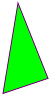

  Code explanation:

  * The points prop defines the x and y coordinates for each corner of the polygon

##### Polyline

The <Polyline> element is used to create any shape that consists of only straight lines:

```html
<Svg
    height="100"
    width="100"
>
    <Polyline
        points="10,10 20,12 30,20 40,60 60,70 95,90"
        fill="none"
        stroke="black"
        strokeWidth="3"
    />
</Svg>
```

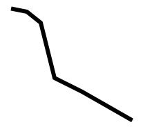

  Code explanation:

  * The points prop defines the x and y coordinates for each point of the polyline

##### Path

The <Path> element is used to define a path.

The following commands are available for path data:

  * M = moveto
  * L = lineto
  * H = horizontal lineto
  * V = vertical lineto
  * C = curveto
  * S = smooth curveto
  * Q = quadratic Bézier curve
  * T = smooth quadratic Bézier curveto
  * A = elliptical Arc
  * Z = closepath
`Note:` All of the commands above can also be expressed with lower letters. Capital letters means absolutely positioned, lower cases means relatively positioned.

```html
<Svg
    height="100"
    width="100"
>
    <Path
        d="M25 10 L98 65 L70 25 L16 77 L11 30 L0 4 L90 50 L50 10 L11 22 L77 95 L20 25"
        fill="none"
        stroke="red"
    />
</Svg>
```

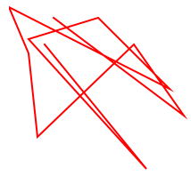


##### Text

The <Text> element is used to define a text.

```html
<Svg
    height="60"
    width="200"
>
    <Text
        fill="none"
        stroke="purple"
        fontSize="20"
        fontWeight="bold"
        x="100"
        y="20"
        textAnchor="middle"
    >STROKED TEXT</Text>
</Svg>
```


##### G

The <G> element is a container used to group other SVG elements. Transformations applied to the g element are performed on all of its child elements, and any of its props are inherited by its child elements. It can also group multiple elements to be referenced later with the [&lt;Use /&gt;](#use) element.

```html
<Svg
    height="100"
    width="200"
>
    <G
        rotate="50"
        origin="100, 50"
    >
        <Line
            x1="60"
            y1="10"
            x2="140"
            y2="10"
            stroke="#060"
        />

        <Rect
            x="60"
            y="20"
            height="50"
            width="80"
            stroke="#060"
            fill="#060"
        />

        <Text
            x="100"
            y="75"
            stroke="#600"
            fill="#600"
            textAnchor="middle"
        >
            Text grouped with shapes</Text>
    </G>
</Svg>
```
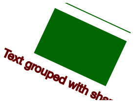

<h5 id="use">Use</h5>

The <Use> element can reuse an SVG shape from elsewhere in the SVG document, including <G> elements and <Symbol> elements.

The reused shape can be defined inside the [&lt;Defs&gt;](#defs) element (which makes the shape invisible until used) or outside.

```html
<Svg
    height="100"
    width="300"
>
    <Defs>
        <G id="shape">
            <G>
                <Circle cx="50" cy="50" r="50" />
                <Rect x="50" y="50" width="50" height="50" />
                <Circle cx="50" cy="50" r="5" fill="blue" />
            </G>
        </G>
    </Defs>
    <Use href="#shape" x="20" y="0"/>
    <Use href="#shape" x="170"y="0" />
</Svg>
```

This example shows a <G> element defined inside a [&lt;Defs&gt;](#defs) element. This makes the <G> invisible unless referenced by a <Use> element.

Before the <G> element can be referenced, it must have an ID set on it via its id prop. The <Use> element references the <G> element via its `href` prop. Notice the # in front of the ID in the prop value.

The <Use> element specifies where to show the reused shapes via its x and y props. Notice that the shapes inside the <G> element are located at 0,0. That is done because their position is added to the position specified in the <Use> element.

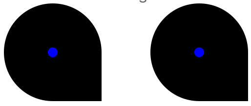


##### Symbol

The SVG <Symbol> element is used to define reusable symbols. The shapes nested inside a <Symbol> are not displayed unless referenced by a <Use> element.

```html
<Svg
    height="150"
    width="110"
>
    <Symbol id="symbol" viewbox="0 0 150 110" width="100" height="50">
        <Circle cx="50" cy="50" r="40" strokeWidth="8" stroke="red" fill="red"/>
        <Circle cx="90" cy="60" r="40" strokeWidth="8" stroke="green" fill="white"/>
    </Symbol>

    <Use
        href="#symbol"
        x="0"
        y="0"
    />
    <Use
        href="#symbol"
        x="0"
        y="50"
        width="75"
        height="38"
    />
    <Use
        href="#symbol"
        x="0"
        y="100"
        width="50"
        height="25"
    />
</Svg>
```

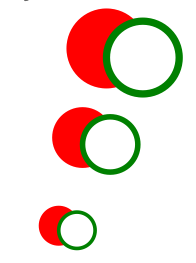

<h5 id="defs">Defs</h5>

The <Defs> element is used to embed definitions that can be reused inside an SVG image. For instance, you can group SVG shapes together and reuse them as a single shape.

##### LinearGradient

The <LinearGradient> element is used to define a linear gradient.
The <LinearGradient> element must be nested within a [&lt;Defs&gt;](#defs) tag. The [&lt;Defs&gt;](#defs) tag is short for definitions and contains definition of special elements (such as gradients).

Linear gradients can be defined as horizontal, vertical or angular gradients:

  * Horizontal gradients are created when y1 and y2 are equal and x1 and x2 differ
  * Vertical gradients are created when x1 and x2 are equal and y1 and y2 differ
  * Angular gradients are created when x1 and x2 differ and y1 and y2 differ

```html
<Svg
    height="150"
    width="300"
>
    <Defs>
        <LinearGradient id="grad" x1="0" y1="0" x2="170" y2="0">
            <Stop offset="0" stopColor="rgb(255,255,0)" stopOpacity="0" />
            <Stop offset="1" stopColor="red" stopOpacity="1" />
        </LinearGradient>
    </Defs>
    <Ellipse cx="150" cy="75" rx="85" ry="55" fill="url(#grad)" />
</Svg>
```

Code explanation:

  * The id prop of the <LinearGradient> tag defines a unique name for the gradient
  * The x1, x2, y1,y2 props of the <LinearGradient> tag define the start and end position of the gradient
  * The color range for a gradient can be composed of two or more colors. Each color is specified with a <Stop> tag. The offset prop is used to define where the gradient color begin and end
  * The fill prop links the ellipse element to the gradient

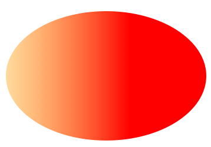

*NOTICE:*
LinearGradient also supports percentage as prop:
```html
<LinearGradient id="grad" x1="0%" y1="0%" x2="100%" y2="0%">
    <Stop offset="0%" stopColor="rgb(255,255,0)" stopOpacity="0" />
    <Stop offset="100%" stopColor="red" stopOpacity="1" />
</LinearGradient>
```
This result is same as the example before.

But I recommend you to use exact number instead, it has more performance advantages while using number instead of percentage.

##### RadialGradient

The <RadialGradient> element is used to define a radial gradient.
The <RadialGradient> element must be nested within a [&lt;Defs&gt;](#defs) tag. The [&lt;Defs&gt;](#defs) tag is short for definitions and contains definition of special elements (such as gradients).

```html
<Svg
    height="150"
    width="300"
>
    <Defs>
        <RadialGradient id="grad" cx="150" cy="75" rx="85" ry="55" fx="150" fy="75">
            <Stop
                offset="0"
                stopColor="#ff0"
                stopOpacity="1"
            />
            <Stop
                offset="1"
                stopColor="#83a"
                stopOpacity="1"
            />
        </RadialGradient>
    </Defs>
    <Ellipse cx="150" cy="75" rx="85" ry="55" fill="url(#grad)" />
</Svg>
```

Code explanation:

  * The id prop of the <radialGradient> tag defines a unique name for the gradient
  * The cx, cy and r props define the outermost circle and the fx and fy define the innermost circle
  * The color range for a gradient can be composed of two or more colors. Each color is specified with a <stop> tag. The offset prop is used to define where the gradient color begin and end
  * The fill prop links the ellipse element to the gradient

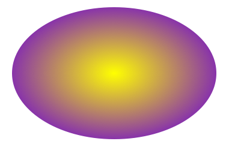

#### Run example:

```bash

cd ./Example
npm install

```

#### TODO:
1. add native method for elements
2. more Text features support (textPath, tspan)
3. Pattern element
4. implement Animated elements
5. load Image from url
6. Mask element

### Known issues:
1. cannot set alpha channel for Gradient on iOS.
2. cannot apply focus point of RadialGradient on Android.

#### Thanks:

* [w3schools.com SVG Tutorial](http://www.w3schools.com/svg/)
* [SVG Tutorial](http://tutorials.jenkov.com/svg/index.html)
* [MDN](https://developer.mozilla.org/en/docs/Web/SVG)
